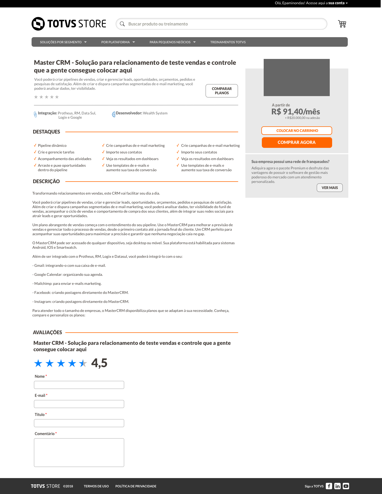

## Desafio Front-end TOTVS Store

Este desafio é apresentado aos candidatos as vagas de desenvolvimento Front-end para avaliar os quesitos técnicos.

### O Desafio
Seu desafio é criar uma simples aplicação que deve conter três páginas sendo:
- Formulário de cadastro de produto (nome, valor, resumo, descrição e imagem);
- Listagem dos produtos com opção de editar e abrir a interface do produto
- Inteface do produto conforme layout proposto;

### Funcionalidades (Interface de apresentação):
- Na interface do produto (images/interface-produto.png):
    - Os dados que não fazem parte do formulário deverá ser fixo conforme desenho;
    - Teremos ações somente nos botões:
        - **Colocar no carrinho** apresenta a seguinte mensagem de forma dinâmica "Produto (Nome do produto) inserido no carrinho com sucesso!";
        - **Comprar agora** apresenta a seguinte mensagem de forma dinâmica "(Boa tarde/Bom dia ou Boa noite) Rafael!\n Sua compra está sendo processada!" a saudação deverá ser conforme o período;
    - Ao inserir uma longa descrição o bloco que contem a imagem do produto, preço, botões e dados sobre o franqueado deverá flutuar semelhante (https://www.udemy.com/course/curso-de-programacao-em-python-do-basico-ao-avancado):
        - Ocultar e exibir a imagem conforme experiência da udemy; 

### Plus:
- Semantic HTML
- Knockout.js;
- PHP;
- Interface responsiva;
- Uso de pré-processador CSS;
- Testes End to End;

### O que esperamos:
- Padrão de Projeto e boas práticas de orientação a objetos;
- Enviar código-fonte via github
- Criar um passo a passo de como rodar sua aplicação;
- Criar uma breve descrição da tecnologia utilizada;

## Interface do produto

